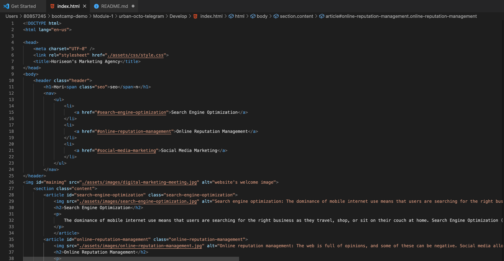
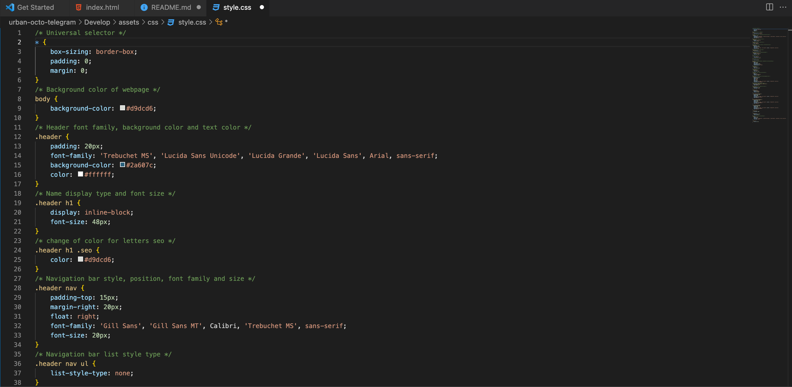

# Code Refactor Starter Code

Refactored the exisiting code to make it easier to read and removed redunancy in CSS

## Links
Active Webpage - https://tahachaudhry.github.io/Module-1/  
GitHub Repository -  https://github.com/tahachaudhry/Module-1

## User Story 
AS A marketing agency 
I WANT a codebase that follows accessibility standards 
SO THAT our own site is optimized for search engines 

## Acceptance Criteria 
GIVEN a webpage meets accessibility standards 
WHEN I view the source code 
THEN I find semantic HTML elements 
WHEN I view the structure of the HTML elements 
THEN I find that the elements follow a logical structure independent of styling and positioning 
WHEN I view the image elements 
THEN I find accessible alt attributes 
WHEN I view the heading attributes 
THEN they fall in sequential order 
WHEN I view the title element 
THEN I find a concise, descriptive title 

## Website Screenshot

## HTML Screenshot

## CSS Screenshot

